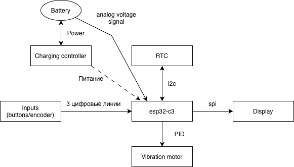
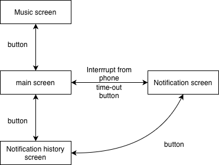

# Eink-watch

Meta-repository of the e-ink watch project. This is the attempt of creating an open‑source smartwatch for everyday use.

## Parts of the project

### Hardware part
All 3D models, PCB, and other files to build the device:  
[DarkCloud894/Eink-watch-hardware](https://github.com/DarkCloud894/Eink-watch-hardware)

### Firmware part
MCU firmware and flashing instructions:  
[qirieshkaclwn/c3-epaper](https://github.com/qirieshkaclwn/c3-epaper)

### Software part
Android companion application:  
[SoHyCa/ClockApp](https://github.com/SoHyCa/ClockApp)

---

# Technical Specification & Design

## Overview

A minimalist e‑ink smartwatch focused on essential functions: time/date, notifications, and music control. Designed for maximum battery efficiency and a distraction‑free experience.

**Key principles:**
- Minimalism – no unnecessary features
- Strict, lightweight UI
- Deep sleep between updates
- Reliable RTC with periodic phone sync

## Hardware

### Required Components
- **Microcontroller:** ESP32‑C3 or ESP32‑C6
- **Display:** E‑ink (EPD) – no backlight, always reflective
- **User input:** 3 buttons for the current version. Optionally encoder.
- **Battery:** Li‑ion / Li‑Po with charging controller
- **Vibration motor:** Haptic feedback
- **RTC (Real‑Time Clock):** External or internal with battery backup (optional)
- **Custom PCB, case & strap**

### System Block Diagram

  

## Software Features

### Watch Faces / Screens
1. **Main screen** – time (hours:minutes) and date
2. **Notification history** – stores recent notifications (as many as memory allows)
3. **Single notification view** – full content of one notification
4. **Music screen** – currently playing track, artist, playback controls

### User Interaction
- **Encoder rotate** – navigate through menus / items
- **Encoder button press** – select / confirm
- **Press + rotate** – special actions (e.g., volume control)
- **Bluetooth events** – incoming data from phone
- **Timer wake‑up** – periodic time update

### Display Update Strategy
- Screen refreshes **at most once per minute** (or on user action)
- No backlight – always readable in ambient light
- Deep sleep between updates

## Power Management

The ESP32 enters **deep sleep** most of the time. A typical cycle:

1. Wake up (by timer or encoder press)
2. Connect to phone via BLE (session lasts milliseconds)
3. Fetch current time, queued notifications, music metadata
4. Prepare display buffer
5. Refresh e‑ink screen
6. Go back to deep sleep for 60 seconds (or remaining interval)

**Wake sources:**
- Timer (60 seconds)
- GPIO interrupt (button)